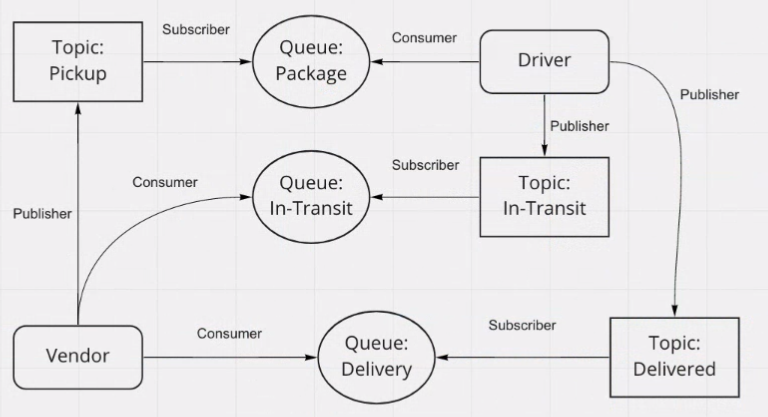
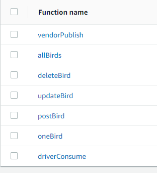

# CAPS using AWS services

Author: Justin Hamerly

## Problem Domain

Using AWS services: SQS, SNS and Lambda, create a cloud version of the CAPS system.

The CAPS system should have the following features:

* SNS Topic: pickup which will receive all pickup requests from vendors
* SQS Queue (FIFO): packages which will contain all delivery requests from vendors, in order of receipt.
* Subscribe this queue to the pickup topic so all pickups are ordered
* SQS Queue (Standard) for each vendor (named for the vendor) which will contain all delivery notifications from the drivers

## Functions

[vendorPublish](./vendorpublish.js)  

* sends a message with the order info to the pickup topic  

[driverConsume](./driverconsume.js)  

* consumes pickup payload from the package queue

[driverPublish](./driverpublish.js)  

* sends message of delivered package to the delivered topic

[vendorConsume](./vendorConsume.js)  

* consumes the delivery from the delivery queue

## UML

## Images  

*Progress 1*  
Added functions for publish and consume.  

Linked all topics and queues to the AWS Lambda functions.  

## Accreditation

Classmates: Sarah Creager and Antoine Charette
